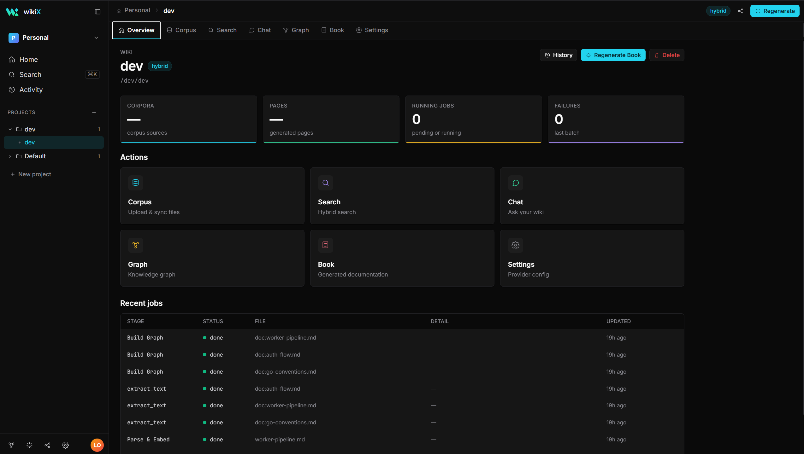
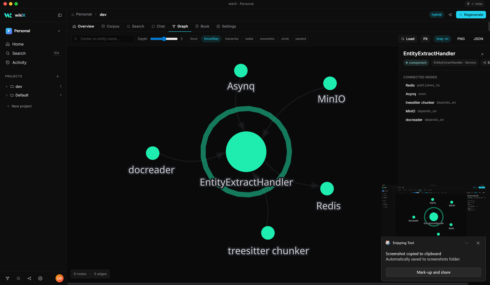
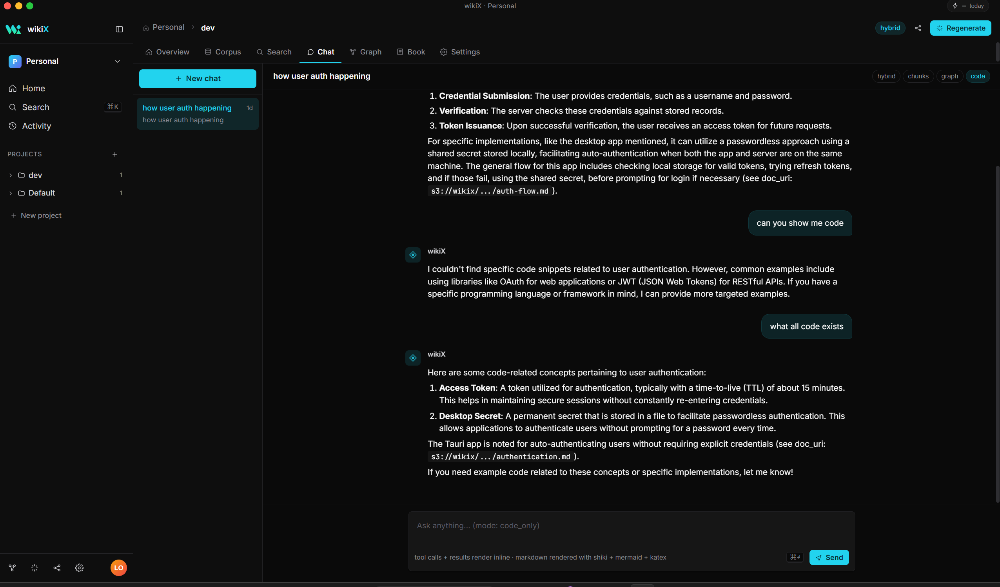

<h1 align="center">wikiX Desktop</h1>
<h2 align="center">Native interface for the wikiX temporal knowledge engine</h2>

<div align="center">


[](https://github.com/vkfolio/wikiX)
[](https://github.com/vkfolio/wikiX)

</div>

> [!NOTE]
> **wikiX Desktop is coming soon.** The engine it talks to — **[vkfolio/wikiX](https://github.com/vkfolio/wikiX)** — is live, MIT-licensed, and self-hostable today. The desktop app is in active development; this repo will host signed installer downloads when it ships.

---

## Preview — Development in Progress

> Screenshots from active development builds. UI is evolving.

**Overview** — corpus sources, sync status, recent jobs at a glance



<br>

**Knowledge Graph** — interactive graph viewer, entity nodes, connected neighbors panel



<br>

**AI Chat** — streaming chat with tool-call cards, syntax-highlighted code, and diagram rendering



---

## What's being built

wikiX Desktop wraps the entire wikiX engine in a polished native interface — no browser tab, no config files, no manual curl. Drop in a folder, watch it ingest, and start querying.

| Tab | What it does |
|---|---|
| **Graph** | Interactive force-directed graph viewer · multiple layouts · confidence-styled edges · PNG + JSON export |
| **Search** | Hybrid retrieval builder · chunks / graph / code / embedding modes · rerank toggle · saved views |
| **Chat** | Streaming chat · tool-call cards with args + result + latency · syntax-highlighted code · diagram + math rendering |
| **Book** | Auto-distilled chapters with `[[wikilinks]]` and `*[cite needed]*` pills |
| **MCP Gateway** | Per-IDE config snippets for Claude Code · Cursor · Codex · Aider |
| **Insights** | God-nodes · surprising connections · recent activity · Atlas cross-wiki map |

**Platforms:** macOS (Apple Silicon + Intel) · Windows 10/11 · Linux (AppImage + deb)

---

## Use the engine today

The desktop is the UI; the engine is the brain — and the engine ships now.

```bash
git clone https://github.com/vkfolio/wikiX.git
cd wikiX
make up-host
make migrate
```

Then point Claude Code, Cursor, Codex, or Aider at the MCP server. All 13 tools work without the desktop app.

→ Full setup guide: **[vkfolio/wikiX](https://github.com/vkfolio/wikiX)**

---

## Relationship to the engine

| Repo | What it is | Status |
|---|---|---|
| [**vkfolio/wikiX**](https://github.com/vkfolio/wikiX) | MIT-licensed knowledge engine — REST API, MCP server, ingest pipeline, retrieval, book distillation | **Live** |
| **vkfolio/WikiX_App** *(this repo)* | Signed installers + auto-update channel for wikiX Desktop | **Coming soon** |
| **vkfolio/wikiX-desktop** | Desktop app source | Private |

The desktop talks to the engine only through its public REST API. Anyone can build a different client against the same engine.

---

## Stay updated

Watch this repo for release notifications. When the desktop ships, installers for all platforms will appear in **[Releases](https://github.com/vkfolio/WikiX_App/releases)**.

---

## Reporting issues

- **Engine bugs / API issues** → [vkfolio/wikiX/issues](https://github.com/vkfolio/wikiX/issues)
- **Desktop feedback / early access** → [vkfolio/WikiX_App/issues](https://github.com/vkfolio/WikiX_App/issues)

---

## Acknowledgements

The stack started with [**Andrej Karpathy's April 2026 post**](https://x.com/karpathy/status/2039805659525644595) on LLM-built knowledge bases. Conceptual debts go to [graphify](https://github.com/safishamsi/graphify) (structural layer) and [graphiti](https://github.com/getzep/graphiti) (bi-temporal layer). Full library credits in the [engine README](https://github.com/vkfolio/wikiX#libraries--frameworks-that-make-this-work).

---

## License

Desktop app will be distributed under the wikiX Desktop EULA. The underlying engine is MIT — [vkfolio/wikiX/LICENSE](https://github.com/vkfolio/wikiX/blob/main/LICENSE).
